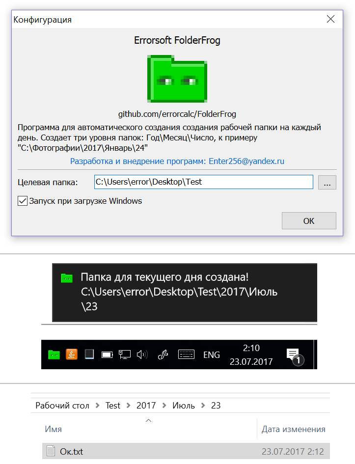
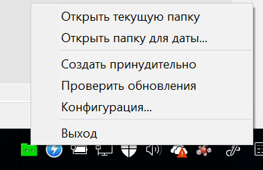
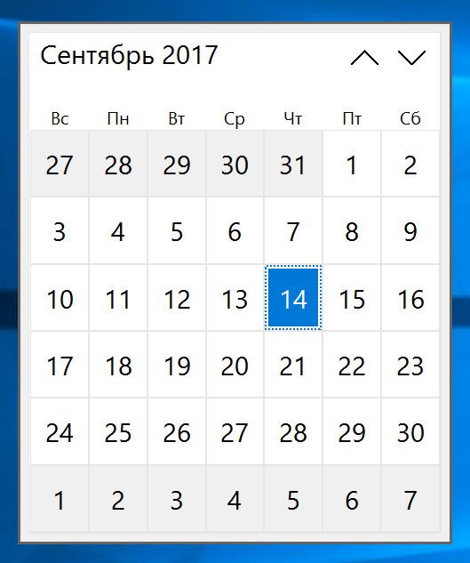

# FolderFrog
  
Программа для автоматического создания создания рабочей папки на каждый день.  
Создает три уровня папок: Год\Месяц\Число, к примеру "C:\Фотографии\2017\Январь\24".  
Из контекстного меню можно открыть проводник с текущей папкой на день:
 

Кроме того можно открыть папку для выбранной даты:
 

# Скачать FolderFrog:
https://raw.githubusercontent.com/errorcalc/FolderFrog/master/FolderFrog.exe

*Лицензия - GNU v2*
